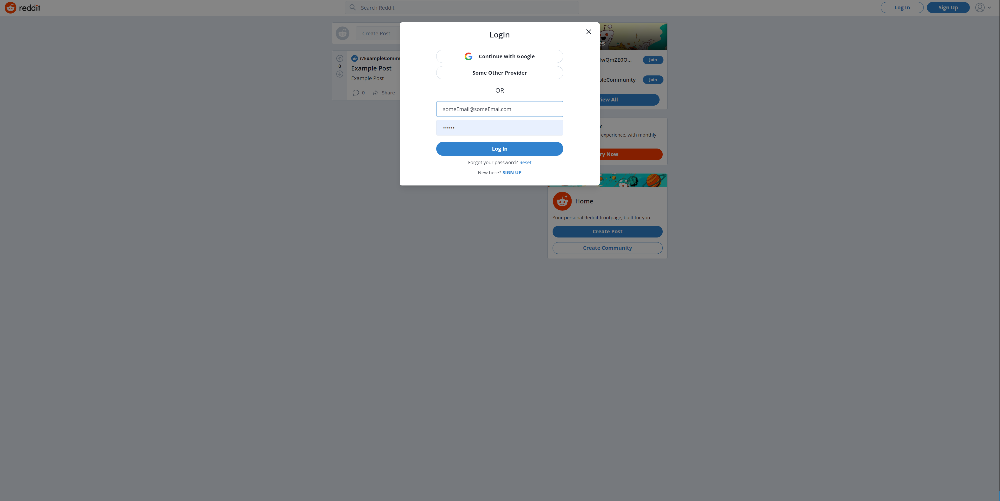
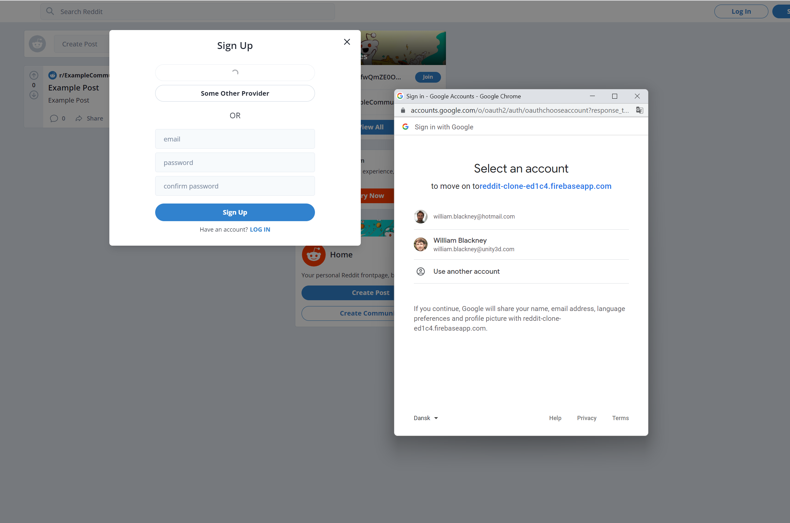
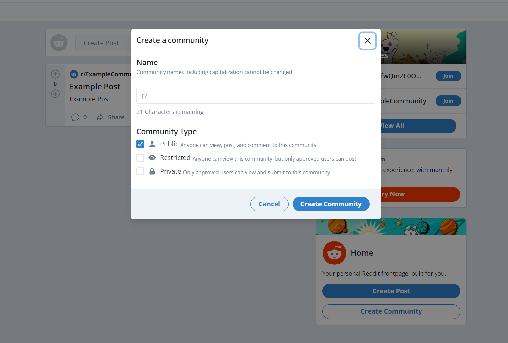
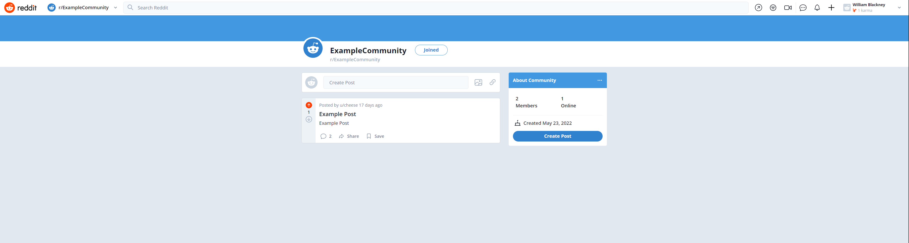
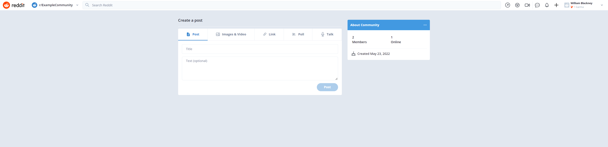
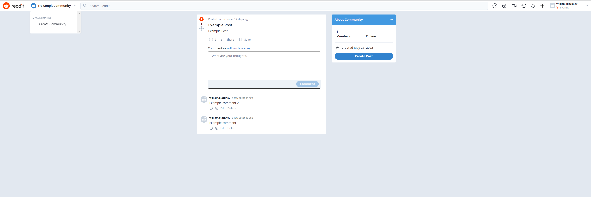

# Reddit Full Stack Project!

### About
A fully functional full stack project that replicates the appearance and features of the Reddit web app, and was one of the largest project’s i’ve ever undertaken! A live version of the app can be viewed here: https://reddit-clone-react-app.vercel.app/ 

### Tools + Tech
- React
- Typescript
- Next.js
- Recoil
- Chakra UI
- Firebase
- Cloud Fire Store

### Features
- Dynamic post feed 
- Create, join and leave communities
- Create, edit and delete posts within communities
- User sign up + login with validation and authentication
- User sign up + login with Google Provider.
- Account creation with validation, and user login and authentication
- Upvote and comment on posts and comments. 
- Karma system
- Server side rendering and dynamic routing from Next.js

### Screenshots

##### Login Modal

##### Signup with Google

##### Create Reddit Communities

##### Visit Community Subreddits

##### Create Posts in Communities

##### View, Upvote and Comment on Posts

